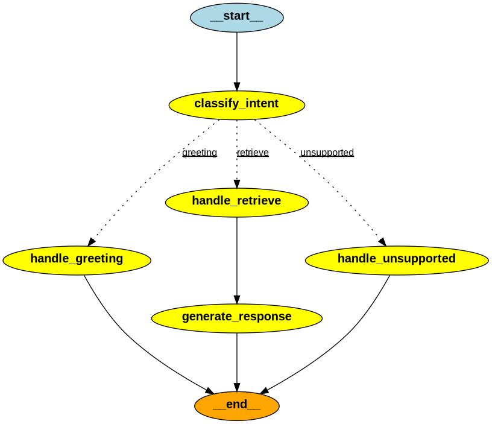

# 🤖 RAG Chatbot - Hỗ trợ Hướng dẫn Sử dụng Phần mềm

Hệ thống **Retrieval-Augmented Generation (RAG)** sử dụng LangGraph để xây dựng chatbot thông minh, hỗ trợ trả lời câu hỏi dựa trên tài liệu hướng dẫn sử dụng phần mềm.



---

## 📋 Mục lục

- [Tính năng](#-tính-năng)
- [Kiến trúc hệ thống](#-kiến-trúc-hệ-thống)
- [Cài đặt](#-cài-đặt)
- [Cấu hình](#-cấu-hình)
- [Sử dụng](#-sử-dụng)
- [Cấu trúc thư mục](#-cấu-trúc-thư-mục)
- [Chi tiết các thành phần](#-chi-tiết-các-thành-phần)

---

## ✨ Tính năng

- **📄 Đọc đa định dạng**: Hỗ trợ PDF, DOCX, Markdown
- **🔍 Hybrid Search**: Kết hợp Vector Search (kNN) và Keyword Search (BM25) với Reciprocal Rank Fusion (RRF)
- **🎯 Intent Classification**: Phân loại ý định người dùng (greeting, retrieve, unsupported)
- **📊 Re-ranking**: Sử dụng Cross-Encoder để sắp xếp lại kết quả tìm kiếm
- **💬 Conversation History**: Lưu giữ lịch sử hội thoại để trả lời có ngữ cảnh
- **🌐 Vietnamese NLP**: Tối ưu cho tiếng Việt với embedding model và tokenizer phù hợp

---

## 🏗 Kiến trúc hệ thống

### RAG Pipeline (Offline - Indexing)

```
┌─────────────┐    ┌──────────────┐    ┌─────────┐    ┌───────────┐    ┌───────────┐    ┌──────────────┐
│   Loader    │───▶│ Preprocessing│───▶│   NER   │───▶│  Chunking │───▶│ Embedding │───▶│ Elasticsearch│
│  (Step 1)   │    │   (Step 2)   │    │(Step 3) │    │ (Step 4)  │    │ (Step 5)  │    │   (Step 6)   │
└─────────────┘    └──────────────┘    └─────────┘    └───────────┘    └───────────┘    └──────────────┘
```

### Query Pipeline (Online - Retrieval)

```
                                    ┌──────────────────┐
                                    │  handle_greeting │──────────────▶ END
                                    └──────────────────┘
                                           ▲
┌─────────┐    ┌─────────────────┐         │
│  Query  │───▶│ classify_intent │─────────┼─────────────────────┐
└─────────┘    └─────────────────┘         │                     │
                                           ▼                     ▼
                                    ┌────────────────┐    ┌──────────────────┐
                                    │handle_retrieve │    │handle_unsupported│──▶ END
                                    └────────────────┘    └──────────────────┘
                                           │
                                           ▼
                                    ┌───────────────┐    ┌──────────────────┐
                                    │   Re-ranking  │───▶│ generate_response │──▶ END
                                    └───────────────┘    └──────────────────┘
```

---

## 🚀 Cài đặt

### 1. Clone repository

```bash
git clone <repository-url>
cd "Thực Hành RAG"
```

### 2. Cài đặt dependencies

```bash
pip install -r requirements.txt
```

### 3. Khởi động Elasticsearch

```bash
# Sử dụng Docker
docker run -d \
  --name elasticsearch \
  -p 9200:9200 \
  -e "discovery.type=single-node" \
  -e "xpack.security.enabled=false" \
  elasticsearch:8.11.0
```

### 4. Cấu hình môi trường

Tạo file `.env` với nội dung:

```env
# Elasticsearch
ELASTICSEARCH_HOST=localhost
ELASTICSEARCH_PORT=9200

# OpenRouter API (cho LLM)
OPENROUTER_API_KEY=your_api_key_here
OPENROUTER_BASE_URL=https://openrouter.ai/api/v1
OPENROUTER_MODEL=google/gemini-2.0-flash-001
```

---

## ⚙️ Cấu hình

| Biến môi trường | Mô tả | Mặc định |
|-----------------|-------|----------|
| `ELASTICSEARCH_HOST` | Host của Elasticsearch | `localhost` |
| `ELASTICSEARCH_PORT` | Port của Elasticsearch | `9200` |
| `OPENROUTER_API_KEY` | API key cho OpenRouter | - |
| `OPENROUTER_MODEL` | Model LLM sử dụng | `google/gemini-2.0-flash-001` |

---

## 💻 Sử dụng

### Chạy Chatbot

```bash
python main.py
```

**Ví dụ tương tác:**

```
RAG Chatbot - Gõ 'exit' để thoát
--------------------------------------------------

Bạn: Làm sao để đổi mật khẩu?

Bot: Để đổi mật khẩu, bạn thực hiện các bước sau:
1. Vào menu Cài đặt > Tài khoản
2. Chọn "Đổi mật khẩu"
3. Nhập mật khẩu cũ và mật khẩu mới
4. Nhấn "Xác nhận"

[Nguồn: tai_lieu_huong_dan.pdf | Trang: 15]

Bạn: exit
👋 Tạm biệt!
```

---

## 📁 Cấu trúc thư mục

```
Thực Hành RAG/
├── 📄 main.py                    # Entry point - Chạy chatbot
├── 📄 requirements.txt           # Dependencies
├── 📄 .env                       # Biến môi trường
├── 📄 graph_flow.png             # Sơ đồ luồng xử lý
├── 📄 walkthrough.md             # Hướng dẫn chi tiết pipeline
│
├── 📁 data/
│   └── 📁 documents/             # Tài liệu để index
│       └── *.pdf, *.docx, *.md
│
└── 📁 src/
    ├── 📄 graph.py               # LangGraph workflow chính
    ├── 📄 LLM_client.py          # Client gọi LLM (OpenRouter)
    ├── 📄 RAG.py                 # RAG Generator (format context + generate)
    │
    ├── 📄 step1_loader.py        # Document Loader (PDF, DOCX, MD)
    ├── 📄 step2_preprocessing.py # Text Preprocessing
    ├── 📄 step3_NER.py           # Named Entity Recognition
    ├── 📄 step4_chungking.py     # Markdown Chunking
    ├── 📄 step5_embedding.py     # Vietnamese Embedding
    ├── 📄 step6_vector_database.py # Elasticsearch Vector Store
    └── 📄 step7_reranking.py     # Cross-Encoder Reranking
```

---

## 🔧 Chi tiết các thành phần

### 1. Document Loader (`step1_loader.py`)

- **Input**: File PDF, DOCX, Markdown
- **Output**: `Document` object với content và metadata
- **Đặc biệt**: Chèn `<!-- PAGE:x -->` marker để tracking số trang

### 2. Preprocessing (`step2_preprocessing.py`)

- Chuẩn hóa khoảng trắng
- Loại bỏ ký tự nhiễu
- Giữ nguyên PAGE markers

### 3. NER (`step3_NER.py`)

- **Model**: `NlpHUST/ner-vietnamese-electra-base`
- Trích xuất: Tên người, Địa điểm, Tổ chức

### 4. Chunking (`step4_chungking.py`)

- **Chiến lược**: Markdown Header Splitter (h1, h2, h3)
- **Chunk size**: 500 tokens (có overlap 50)
- **Metadata**: page, h1, h2, h3, source, entities

### 5. Embedding (`step5_embedding.py`)

- **Model**: `dangvantuan/vietnamese-embedding` (768 dims)
- **Tokenizer**: PyVi (word segmentation)

### 6. Vector Database (`step6_vector_database.py`)

- **Engine**: Elasticsearch 8.x
- **Search methods**:
  - `search_by_knn()`: Cosine similarity
  - `search_by_BM25()`: Keyword search trên metadata (h1, h2, h3)
  - `search_hybrid()`: Kết hợp với **RRF (Reciprocal Rank Fusion)**

### 7. Reranking (`step7_reranking.py`)

- **Model**: Cross-Encoder
- Sắp xếp lại top-k kết quả để tăng độ chính xác

### 8. LangGraph Workflow (`graph.py`)

| Node | Mô tả |
|------|-------|
| `classify_intent` | Phân loại ý định bằng embedding similarity |
| `handle_greeting` | Xử lý chào hỏi |
| `handle_retrieve` | Hybrid search + Reranking |
| `generate_response` | Gọi LLM sinh câu trả lời |
| `handle_unsupported` | Xử lý câu hỏi không hỗ trợ |

---

## 📊 Công nghệ sử dụng

| Thành phần | Công nghệ |
|------------|-----------|
| Framework | LangGraph, LangChain |
| Vector DB | Elasticsearch 8.x |
| Embedding | SentenceTransformers (Vietnamese) |
| LLM | OpenRouter API (Gemini, GPT-4, Claude...) |
| Reranking | Cross-Encoder |
| NLP | PyVi, HuggingFace Transformers |

---

## 🛠 Phát triển tiếp

Các tính năng có thể bổ sung:

- [ ] **Query Rewriting**: Viết lại câu hỏi để tối ưu tìm kiếm
- [ ] **Document Grading**: LLM đánh giá tài liệu có liên quan không
- [ ] **Hallucination Check**: Kiểm tra câu trả lời có dựa trên context không
- [ ] **Web Search**: Tìm kiếm web khi không có tài liệu nội bộ
- [ ] **Caching**: Cache kết quả để tăng tốc

---

## 📝 License

MIT License

---

## 👨‍💻 Tác giả

Công Trần

---

*Đây là dự án thực hành RAG - Mục đích học tập và nghiên cứu.*
